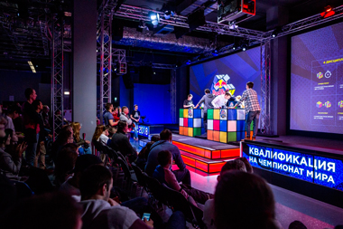
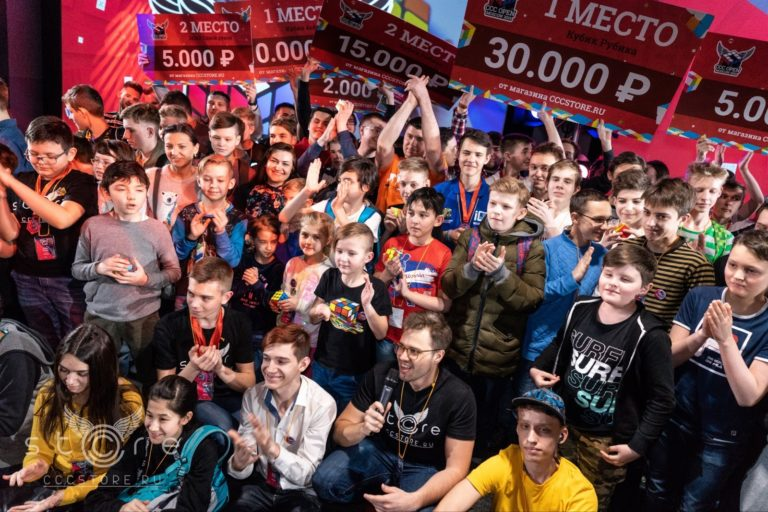

# 
**Чемпионат мира по сборке кубика рубика** 

## **Описание**

Первый Чемпионат мира по спидкубингу провели в 1982 году на фоне общемирового интереса к новой головоломке. Тогда в соревнованиях приняли участие всего лишь 19 человек из разных стран. Состязания открывал сам Эрно Рубик, а соперники состязались только в одной дисциплине: известный многим классический кубик Рубика 3х3х3.

</img>
 
Изменились правила соревнований, были изобретены и включены в список дисциплин новые головоломки, а также изменилось техническое оснащение, применяемое для учета скорости сборки головоломок спортсменами.

---

## **Современные чемпионаты**

Соревнования по спидкубингу проводятся с соблюдением всех требований Всемирной Ассоциации Кубика.

</img>

---
## **Широкая спонсорская поддержка**

Соревнования проходят при спонсорской поддержке:
* крупных магазинов головоломок; 
* спортивных организаций; 
* площадок для мероприятий;
* частных заинтересованных лиц.

---
### *Ссылка на сайт:*
https://cubingrf.org/competitions/

